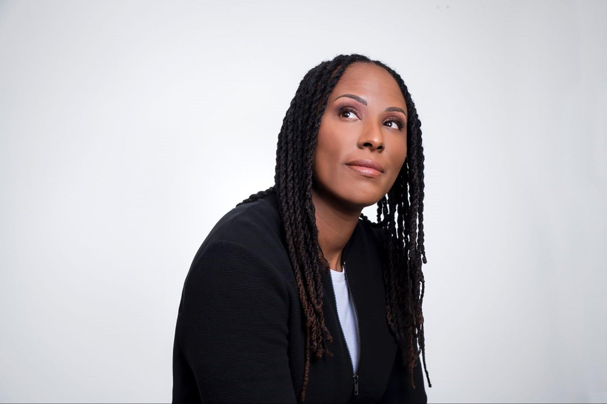

### Speaker: Chamique Holdsclaw

{:class="img-right-50"} This annual convocation celebrates the life and dreams of Dr. Martin Luther King Jr. with presentations about equality, freedom, justice, and opportunity. This year we welcome Olympic Gold Medalist & WNBA Hall of Famer, Chamique Holdsclaw.

Hailed as the “female Michael Jordan,” Chamique Holdsclaw was a basketball superstar. From leading The University of Tennessee Lady Volunteers to three straight NCAA national championships with her team and legendary Coach Pat Summitt to the Olympics to the WNBA, nearly no one has had more focus or drive on the court. And yet underneath, she was pushing down mental health issues that eventually led to a total mental and physical breakdown.

Chamique suffered from serious bouts of depression and manic episodes, a suicide attempt and an incident in Atlanta involving a firearm. After the episode in Georgia, she was finally open to getting help and was diagnosed with bipolar disorder and severe anxiety.

After a long journey of learning to manage her illness, Chamique has come back just as fierce. But this time, she’s dedicated her life’s work to mental health and wellness activism-- sharing her own personal struggles with depression depicted in her documentary, Mind/Game: The Unquiet Journey of Chamique Holdsclaw.

As a speaker, her talks are incredibly inspiring and have helped many open up about their own mental health issues or assisted those dealing with loved ones who suffer to seek support. Or as Chamique describes it, “being transparent, raw and real to help as many people as I can.”

Chamique was raised in Queens, N.Y. in a middle-class neighborhood. But with her parents no longer able to take care of her, she moved in with her beloved grandmother in the projects in Astoria. Her grandmother’s rule to keep her and her brother on track: Get involved in something good. For Chamique, it was basketball. To forget her problems, she totally focused on her game and learned the skills that made her a powerhouse.

She first made her mark as a high school basketball star at Christ The King High School. She later accepted a full athletic scholarship to play for Tennessee. The three straight championships for the Volunteers were the first that had ever been accomplished in Women’s College Basketball history.

After her illustrious college basketball career, which included several All-American honors and countless other awards, Chamique would go on to be the #1 Pick in the 1999 WNBA Draft by the Washington Mystics. Her rookie season was capped with a WNBA Rookie of the Year Award as well as her first of six WNBA All-Star appearances. In 2000, she had the honor of winning an Olympic Gold Medal with Team USA at the 2000 Sydney Olympic Games.

Chamique is an honorary member of Alpha Kappa Alpha Sorority, Inc. and an ambassador with Laureus Sport for Good and with the JED Foundation as an advocate for mental health and wellness. She is also a member of the Boys & Girls Club Hall of Fame.

Doors open at 6 p.m., program begins at 6:30 p.m.
